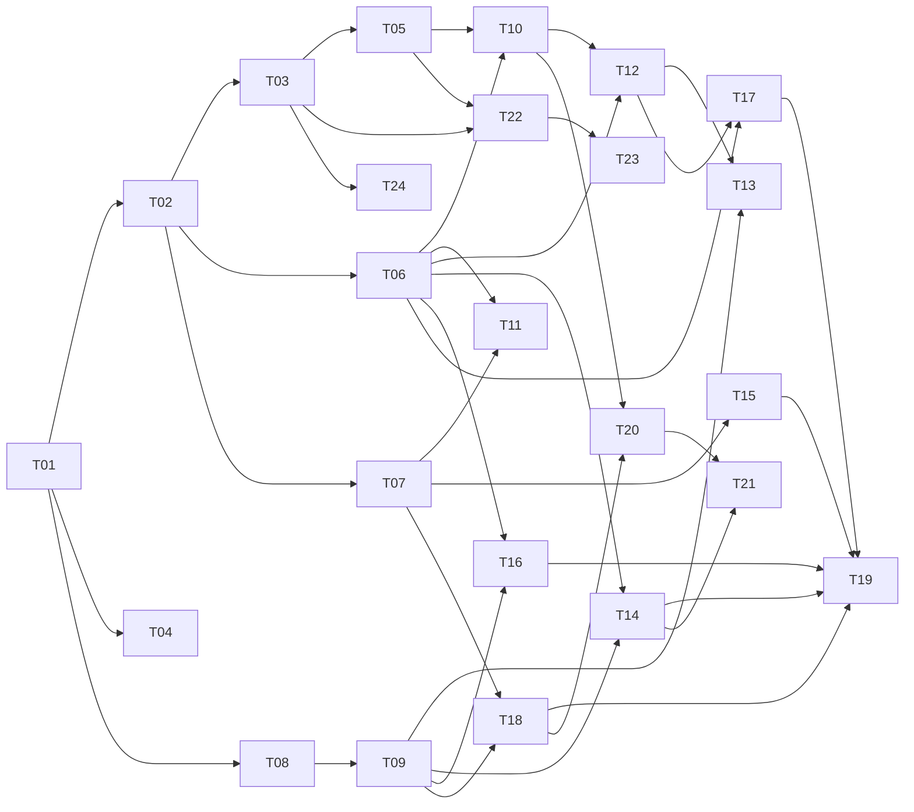

# Task-план ForgeIDE

> Декомпозиция реализации по [SD §11](../sd/system-design.md) и [SDD](../sdd/sdd.md).
> Формат файла задачи: веха, зависимости, ссылки на спеку, скоуп, вне скоупа, приёмка.

## Реестр

| ID | Задача | Веха | Зависит от |
|---|---|---|---|
| [T01](T01-skeleton.md) | Каркас: модули Gradle, JavaFX bootstrap | M1 | — |
| [T02](T02-domain-model.md) | Доменная модель core | M1 | T01 |
| [T03](T03-pipeline-yaml.md) | pipeline.yaml: парсер и валидатор | M1 | T02 |
| [T04](T04-project-management.md) | Проекты и рантаймы | M1 | T01, T02 |
| [T05](T05-canvas-readonly.md) | Канвас: read-only рендер | M1 | T03 |
| [T06](T06-engine.md) | PipelineEngine: актор и переходы | M2 | T02 |
| [T07](T07-statestore-audit.md) | StateStore: SoT + hash-chain аудит | M2 | T02 |
| [T08](T08-process-runner.md) | ProcessRunner: stdio, process group, kill | M2 | T01 |
| [T09](T09-executors.md) | ScriptExecutor + AgentRuntime (stream-json) | M2 | T08 |
| [T10](T10-run-view.md) | Run view: live-лог, timeline | M2 | T05, T06 |
| [T11](T11-resumability.md) | Резюмируемость и ретраи | M2 | T06, T07 |
| [T12](T12-gates.md) | Гейты человека | M3 | T06, T10 |
| [T13](T13-pending-questions.md) | Вопросы от модели (WAITING_INPUT) | M3 | T09, T12 |
| [T14](T14-judges.md) | Судьи: композиция, ре-итерации, эскалация | M3 | T06, T09 |
| [T15](T15-manifest-projection.md) | Проекция манифеста + tamper-hash | M3 | T07 |
| [T16](T16-env-scope-diff.md) | Env-скоупинг + scope-diff | M3 | T06, T09 |
| [T17](T17-outward-actions.md) | Outward-шаги движка (push/PR/Jira) | M3 | T06, T12 |
| [T18](T18-harness-integrity.md) | Целостность обвязки: кэш, hash, preflight | M3 | T07, T09 |
| [T19](T19-evil-fixtures.md) | Анти-обходная приёмка (злые фикстуры) | M3 | T14–T18 |
| [T20](T20-editors.md) | Редакторы: промпты, судьи (trusted-путь) | M4 | T10, T18 |
| [T21](T21-dry-run.md) | Dry-run судьи + предпросмотр промпта | M4 | T14, T20 |
| [T22](T22-constructor.md) | Конструктор пайплайнов на канвасе | M4 | T03, T05 |
| [T23](T23-tile-library.md) | Библиотека плиток, плитка с нуля | M4 | T22 |
| [T24](T24-importer.md) | Импортёр Forge-обвязки | M4 | T03 |

## Граф зависимостей

## Параллелизация

- **Старт в параллель после T01/T02:** дорожка UI (T03→T05), дорожка движка (T06, T07),
  дорожка процессов (T08→T09), T04 независимо.
- **Критический путь:** T01 → T02 → T06 → T14 → T19 (движок и судьи).
- T24 (импортёр) не блокирует ничего — можно делать в любой момент после T03.
