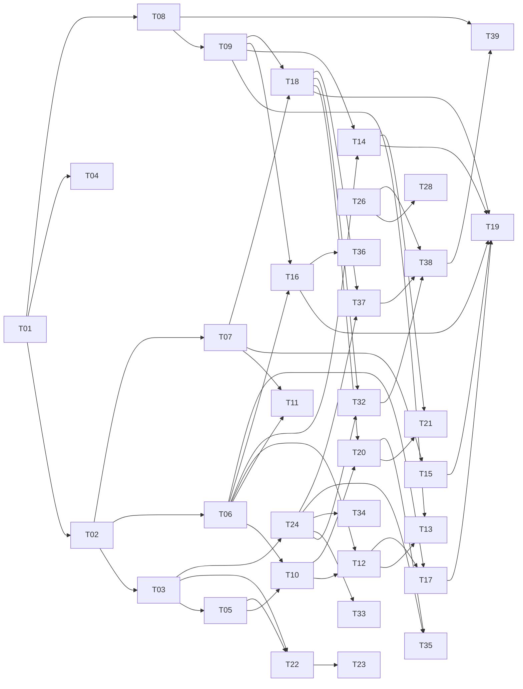

# Task-план ForgeIDE

> Декомпозиция реализации по [SD §11](../sd/system-design.md) и [SDD](../sdd/sdd.md).
> Формат файла задачи: веха, зависимости, ссылки на спеку, скоуп, вне скоупа, приёмка.

## Реестр

| ID | Задача | Веха | Зависит от |
|---|---|---|---|
| [T01](T01-skeleton.md) | Каркас: модули Gradle, JavaFX bootstrap | M1 | — |
| [T02](T02-domain-model.md) | Доменная модель core | M1 | T01 |
| [T03](T03-pipeline-yaml.md) | pipeline.yaml: парсер и валидатор | M1 | T02 |
| [T04](T04-project-management.md) | Проекты и рантаймы | M1 | T01, T02 |
| [T05](T05-canvas-readonly.md) | Канвас: read-only рендер | M1 | T03 |
| [T06](T06-engine.md) | PipelineEngine: актор и переходы | M2 | T02 |
| [T07](T07-statestore-audit.md) | StateStore: SoT + hash-chain аудит | M2 | T02 |
| [T08](T08-process-runner.md) | ProcessRunner: stdio, process group, kill | M2 | T01 |
| [T09](T09-executors.md) | ScriptExecutor + AgentRuntime (stream-json) | M2 | T08 |
| [T10](T10-run-view.md) | Run view: live-лог, timeline | M2 | T05, T06 |
| [T11](T11-resumability.md) | Резюмируемость и ретраи | M2 | T06, T07 |
| [T12](T12-gates.md) | Гейты человека | M3 | T06, T10 |
| [T13](T13-pending-questions.md) | Вопросы от модели (WAITING_INPUT) | M3 | T09, T12 |
| [T14](T14-judges.md) | Судьи: композиция, ре-итерации, эскалация | M3 | T06, T09 |
| [T15](T15-manifest-projection.md) | Проекция манифеста + tamper-hash | M3 | T07 |
| [T16](T16-env-scope-diff.md) | Env-скоупинг + scope-diff | M3 | T06, T09 |
| [T17](T17-outward-actions.md) | Outward-шаги движка (push/PR/Jira) | M3 | T06, T12 |
| [T18](T18-harness-integrity.md) | Целостность обвязки: кэш, hash, preflight | M3 | T07, T09 |
| [T19](T19-evil-fixtures.md) | Анти-обходная приёмка (злые фикстуры) | M3 | T14–T18 |
| [T20](T20-editors.md) | Редакторы: промпты, судьи (trusted-путь) | M4 | T10, T18 |
| [T21](T21-dry-run.md) | Dry-run судьи + предпросмотр промпта | M4 | T14, T20 |
| [T22](T22-constructor.md) | Конструктор пайплайнов на канвасе | M4 | T03, T05 |
| [T23](T23-tile-library.md) | Библиотека плиток, плитка с нуля | M4 | T22 |
| [T24](T24-importer.md) | Импортёр Forge-обвязки | M4 | T03 |
| [T25](T25-question-escalation-editor.md) | Эскалация вопросов: открыть промпт в редакторе | M5 | — |
| [T26](T26-ci-coverage.md) | CI и измерение покрытия | M5 | — |
| [T27](T27-secret-masking.md) | Маскирование секретов + выравнивание спеки | M5 | — |
| [T28](T28-engine-decomposition.md) | Декомпозиция PipelineEngine | M5 | T26 |
| [T29](T29-phase-sandbox.md) | Интерфейс PhaseSandbox | M5 | — |
| [T30](T30-readme-distribution.md) | README и кросс-платформенный дистрибутив | M5 | — |
| [T31](T31-acceptance-test-debt.md) | Дотесты приёмки: палитра e2e, NFR-замеры | M5 | — |
| [T32](T32-hooks-path-unification.md) | Единый путь settings.hooks.json (импортёр ↔ preflight) | M5 | T18, T24 |
| [T33](T33-importer-section-binding.md) | Импортёр: привязка по §-секции, неоднозначный матчинг | M5 | T24 |
| [T34](T34-importer-full-skill-copy.md) | Импортёр: полное копирование каталога скилла | M5 | T24 |
| [T35](T35-importer-reimport-safety.md) | Импортёр: безопасный повторный импорт | M5 | T20, T24 |
| [T36](T36-dirty-tree-warning.md) | Предупреждение о грязном дереве, границы scope-diff | M5 | T16 |
| [T37](T37-harness-deploy-ui.md) | Деплой обвязки из UI | M5 | T18, T24 |
| [T38](T38-import-chain-and-ci-green.md) | Зелёный CI и цепочка импорт → deploy → preflight | M5 | T26, T32, T37 |
| [T39](T39-linux-stdin-process-group.md) | Linux: stdin фаз и группа процессов | M5 | T08, T38 |

## Граф зависимостей

## Параллелизация

- **Старт в параллель после T01/T02:** дорожка UI (T03→T05), дорожка движка (T06, T07),
  дорожка процессов (T08→T09), T04 независимо.
- **Критический путь:** T01 → T02 → T06 → T14 → T19 (движок и судьи).
- T24 (импортёр) не блокирует ничего — можно делать в любой момент после T03.

## M5 — доработки по аудиту 2026-07-10

Веха собрана из находок продуктового аудита (M1–M4 завершены, 479 тестов зелёные).
Все задачи независимы и идут в параллель, кроме T28 — он ждёт CI (T26) как страховку
рефакторинга.

- **До реального использования:** T26 (CI), T27 (маскирование секретов), T30 (README).
- **Гигиена/пост-MVP:** T28 (декомпозиция движка), T29 (PhaseSandbox), T31 (дотесты
  приёмки и NFR-замеры), кросс-платформенная часть T30.

## M5 — доработки по ревью импортёра 2026-07-11

Находки критического ревью цепочки «импорт → деплой → прогон» (T24/T18/T16).
Все задачи независимы друг от друга и идут в параллель.

- **Блокеры первого запуска:** T37 — деплой обвязки (`HarnessGuardPort.deploy()`)
  не вызывается ни из одного экрана UI, любой свежий проект встаёт на
  `HARNESS_PREFLIGHT`; T32 — импортёр кладёт `settings.hooks.json` в
  `.gigacode/hooks/`, preflight ждёт его в корне харнесса.
- **До реального использования импортёра:** T34 (скилл копируется частично —
  references/ не едут), T35 (re-import молча перезаписывает локальные правки).
- **Юзабилити/прозрачность:** T33 (ручная привязка только целым файлом,
  неоднозначный автоматч берёт первую секцию молча), T36 (грязное дерево
  ослабляет scope-diff — предупреждение и документация слепых зон).

## M5 — доработки по повторному аудиту 2026-07-12

Повторный аудит после мержа T25–T37: две находки, обе — «зелёное локально, красное в
реальности», потому что ни один тест не пересекал нужную границу.

- **T38** — CI на GitHub никогда не был зелёным (порог покрытия runtime зависел от
  смоук-теста, который в CI скипается), и цепочка «импорт → deploy → preflight» падала
  на любой обвязке, чей `settings.hooks.json` ссылается на скрипты хуков: скрипты не
  копировались импортёром, а preflight трактовал команду как один путь.
- **T39** — вторая причина красного CI, вскрылась после мержа T38: на Linux (`/bin/sh`
  = dash) обёртка группы процессов теряла stdin фаз (промпт агента, payload хуков — в
  /dev/null) и не отделяла группу процессов ребёнка. Продуктовый баг NFR-5, не тестовый.
